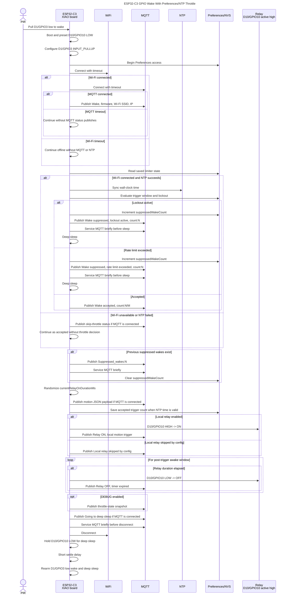

# Firmware Flow

This Mermaid sequence diagram mirrors `docs/firmware-flow.puml` and is easier
to preview in Markdown renderers that support Mermaid.

```mermaid
sequenceDiagram
    title ESP32-C3 GPIO Wake With Preferences/NTP Throttle

    actor PIR
    participant ESP as ESP32-C3<br/>XIAO board
    participant WIFI as WiFi
    participant MQTT
    participant NTP
    participant NVS as Preferences/NVS
    participant RELAY as Relay<br/>D10/GPIO10 active high

    PIR->>ESP: Pull D1/GPIO3 low to wake
    ESP->>ESP: Boot and preset D10/GPIO10 LOW
    ESP->>ESP: Configure D1/GPIO3 INPUT_PULLUP
    ESP->>NVS: Begin Preferences access

    ESP->>WIFI: Connect with timeout
    alt Wi-Fi connected
        ESP->>MQTT: Connect with timeout
        alt MQTT connected
            ESP->>MQTT: Publish Wake, firmware, Wi-Fi SSID, IP
        else MQTT timeout
            ESP->>ESP: Continue without MQTT status publishes
        end
    else Wi-Fi timeout
        ESP->>ESP: Continue offline without MQTT or NTP
    end

    ESP->>NVS: Read saved limiter state
    alt Wi-Fi connected and NTP succeeds
        ESP->>NTP: Sync wall-clock time
        ESP->>NVS: Evaluate trigger window and lockout
        alt Lockout active
            ESP->>NVS: Increment suppressedWakeCount
            ESP->>MQTT: Publish Wake suppressed, lockout active, count:N
            ESP->>MQTT: Service MQTT briefly before sleep
            ESP->>ESP: Deep sleep
        else Rate limit exceeded
            ESP->>NVS: Increment suppressedWakeCount
            ESP->>MQTT: Publish Wake suppressed, rate limit exceeded, count:N
            ESP->>MQTT: Service MQTT briefly before sleep
            ESP->>ESP: Deep sleep
        else Accepted
            ESP->>MQTT: Publish Wake accepted, count:N/M
        end
    else Wi-Fi unavailable or NTP failed
        ESP->>MQTT: Publish skip-throttle status if MQTT is connected
        ESP->>ESP: Continue as accepted without throttle decision
    end

    alt Previous suppressed wakes exist
        ESP->>MQTT: Publish Suppressed_wakes:N
        ESP->>MQTT: Service MQTT briefly
        ESP->>NVS: Clear suppressedWakeCount
    end

    ESP->>ESP: Randomize currentRelayOnDurationMs
    ESP->>MQTT: Publish motion JSON payload if MQTT is connected
    ESP->>NVS: Save accepted trigger count when NTP time is valid
    alt Local relay enabled
        ESP->>RELAY: D10/GPIO10 HIGH -> ON
        ESP->>MQTT: Publish Relay ON, local motion trigger
    else Local relay skipped by config
        ESP->>MQTT: Publish Local relay skipped by config
    end

    loop For post-trigger awake window
        alt Relay duration elapsed
            ESP->>RELAY: D10/GPIO10 LOW -> OFF
            ESP->>MQTT: Publish Relay OFF, timer expired
        end
    end

    opt DEBUG enabled
        ESP->>MQTT: Publish throttle-state snapshot
    end

    ESP->>MQTT: Publish Going to deep sleep if MQTT is connected
    ESP->>MQTT: Service MQTT briefly before disconnect
    ESP->>WIFI: Disconnect
    ESP->>ESP: Hold D10/GPIO10 LOW for deep sleep
    ESP->>ESP: Short settle delay
    ESP->>ESP: Rearm D1/GPIO3 low wake and deep sleep
```
