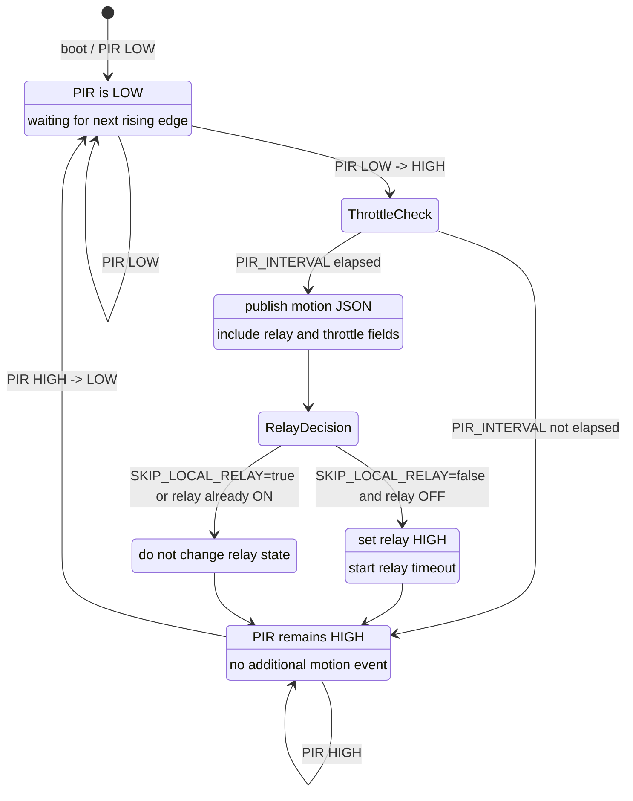

# PIR Motion State Diagram

Relay timeout runs independently: when `RELAY_MAX_ON_DURATION` elapses, the relay is set LOW and `Relay_OFF (timer expired)` is published. That does not create a new motion event.
